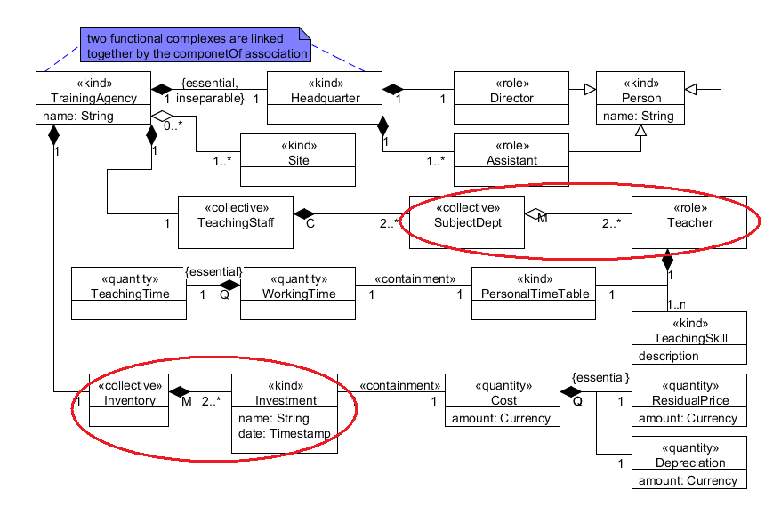

Examples
--------

.. _memberOf-examples-ex1:

**EX1:** |MemberOf Relation|

See also :ref:`part-whole`.

**References:**

GUIZZARDI, Giancarlo. *Ontological Foundations for Structural Conceptual Models.* Enschede: CTIT, Telematica Instituut, 2005. GUIZZARDI, Giancarlo. *Introduction to Ontological Engineering.* [presentation] Prague: Prague University of Economics, 2011.

