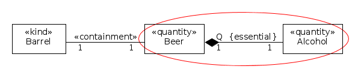
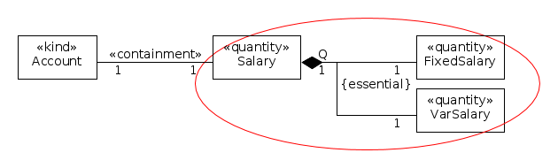
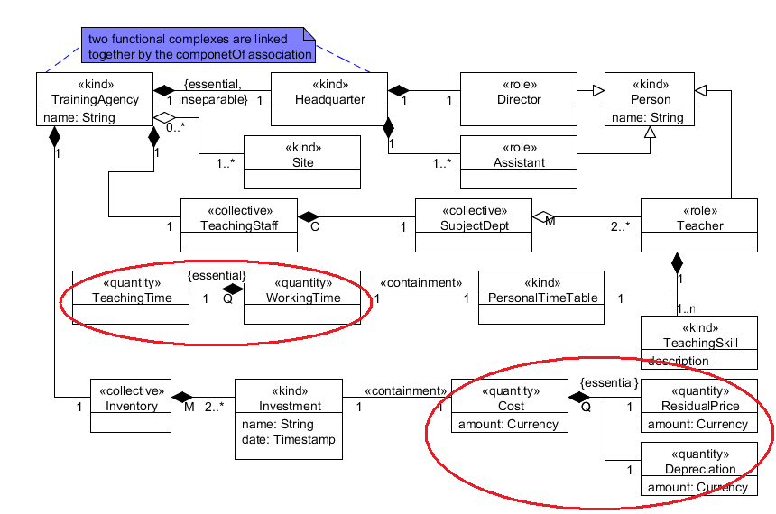

Examples
--------

.. _subQuantityOf-examples-ex1:

**EX1:** |Typical Subquantity|

.. _subQuantityOf-examples-ex2:

**EX2:** |Another Example of Subquantity|

.. _subQuantityOf-examples-ex3:

**EX3:** |Examples of Subquantity|

See also

-  :ref:`part-whole`
-  «:ref:`containment`»

**References:**

GUIZZARDI, Giancarlo. *Ontological Foundations for Structural Conceptual Models.* Enschede: CTIT, Telematica Instituut, 2005. GUIZZARDI, Giancarlo. *Introduction to Ontological Engineering.* [presentation] Prague: Prague University of Economics, 2011.

