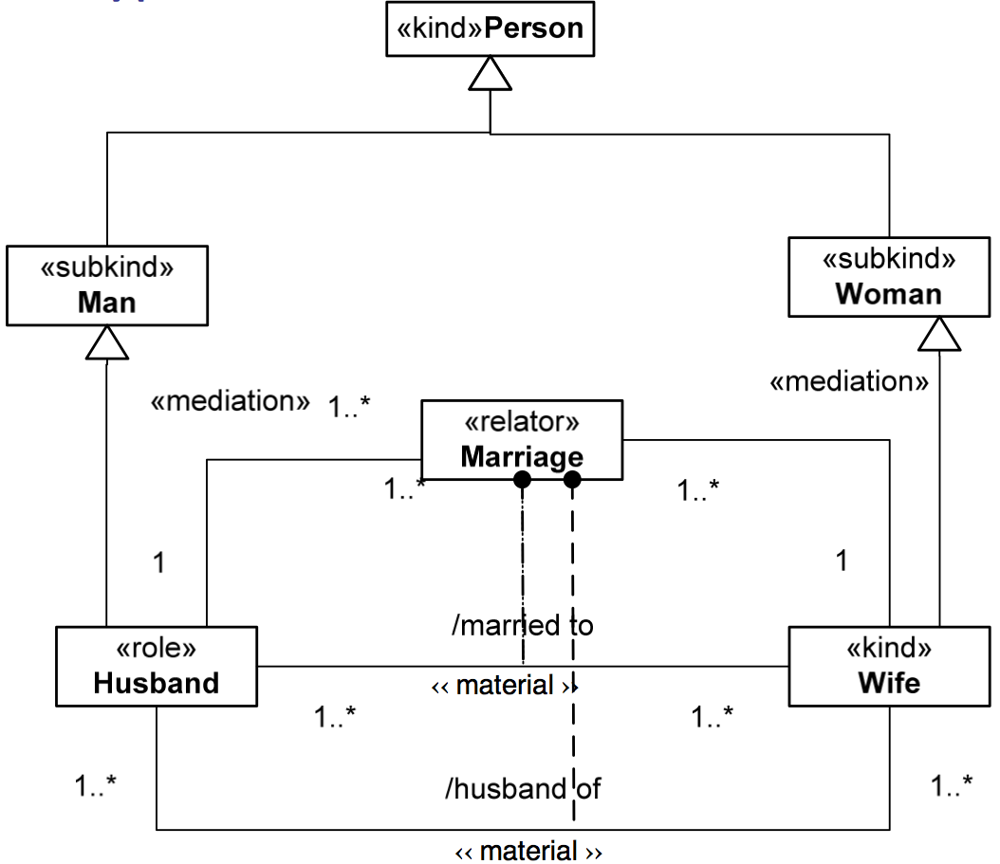
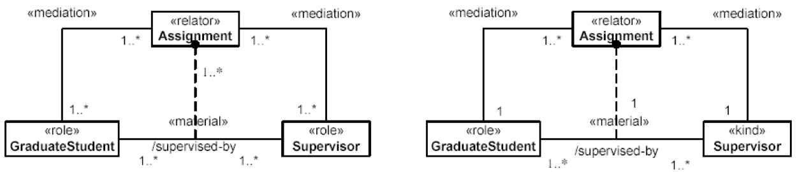

Examples
--------

.. _material-examples-ex1:
**EX1:**

.. container:: figure

   |Example marriage|

.. _material-examples-ex2:
**EX2:**

.. container:: figure

   |Example supervizor|

For more examples see «:ref:`relator`», «:ref:`derivation`», «:ref:`mediation`», and «:ref:`relator-pattern`».

**Quoted from:**

GUIZZARDI, Giancarlo. *Ontological Foundations for Structural Conceptual Models.* Enschede: CTIT, Telematica Instituut, 2005. GUIZZARDI, Giancarlo. *Introduction to Ontological Engineering.* [presentation] Prague: Prague University of Economics, 2011.

