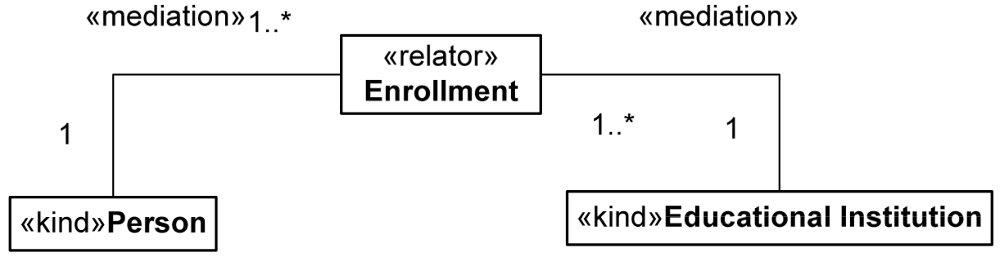

Examples
--------

.. _mediation-examples-ex1:
**EX1:**

.. container:: figure

   |Mediation example|

For more examples see «:ref:`relator`», «:ref:`material`», and «:ref:`relator-pattern`».

**Quoted from:**

GUIZZARDI, Giancarlo. *Introduction to Ontological Engineering.* [presentation] Prague: Prague University of Economics, 2011.

