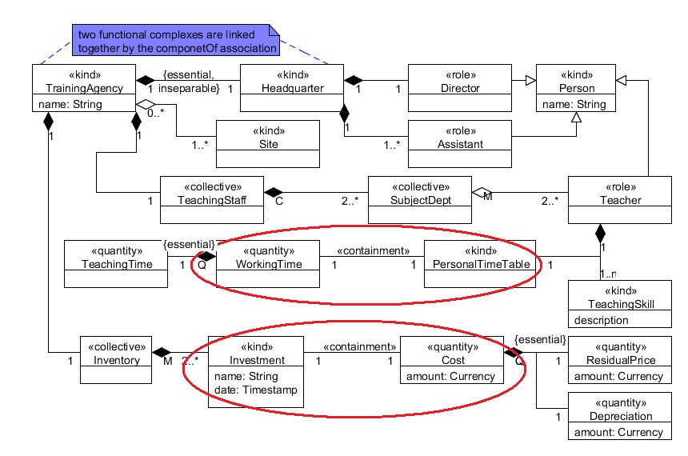

Examples
--------

**EX1:** [caption id="attachment_771" align="alignnone"
width="360"]\ |image0| Typical Containment[/caption] **EX2:** [caption
id="attachment_651" align="alignnone" width="360"]\ |image1| Another
Example of Containment[/caption] **EX3:** [caption id="attachment_765"
align="alignnone" width="860"]\ |image2| Examples of
Containment[/caption] See also

-  `SubquantityOf
   Relation </ufo/wiki/part-whole-relation/subquantityof/>`__
-  `Part-Whole Relation </ufo/wiki/part-whole-relation/>`__.

**References:** GUIZZARDI, Giancarlo. *Ontological Foundations for
Structural Conceptual Models.* Enschede: CTIT, Telematica Instituut,
2005. GUIZZARDI, Giancarlo. *Introduction to Ontological Engineering.*
[presentation] Prague: Prague University of Economics, 2011.

.. |image0| image:: _images/containment3.png
.. |image1| image:: _images/containment.png

