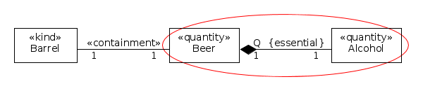

Examples
--------

**EX1:** [caption id="attachment_770" align="alignnone"
width="600"]\ |image0| Typical Subquantity[/caption] **EX2:** [caption
id="attachment_769" align="alignnone" width="630"]\ |image1| Another
Example of Subquantity[/caption] **EX3:** [caption id="attachment_768"
align="alignnone" width="860"]\ |image2| Examples of
Subquantity[/caption]

See also

-  :ref:`part-whole
-  «:ref:`containment`»

**References:** GUIZZARDI, Giancarlo. *Ontological Foundations for
Structural Conceptual Models.* Enschede: CTIT, Telematica Instituut,
2005. GUIZZARDI, Giancarlo. *Introduction to Ontological Engineering.*
[presentation] Prague: Prague University of Economics, 2011.

.. |image1| image:: _images/subquantity3.png
.. |image2| image:: _images/subQuantity.png