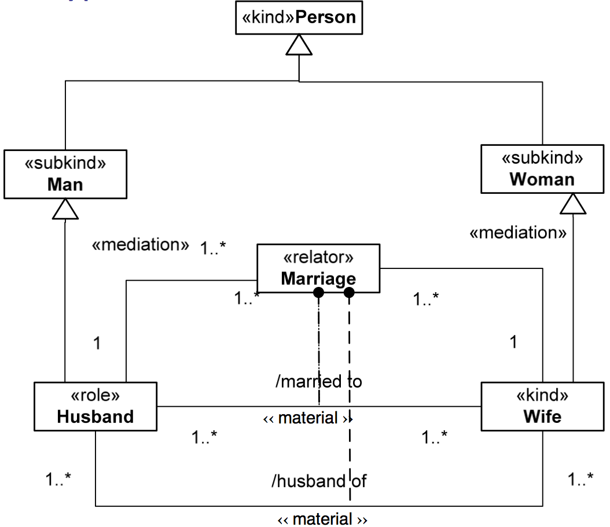
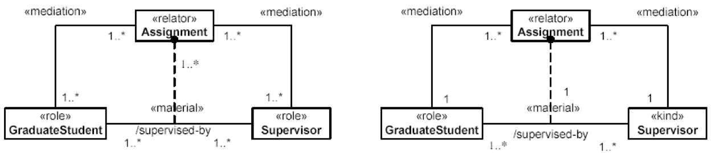

Examples
--------

**EX1:**

.. container:: figure

   |Example marriage|

  **EX2:**

.. container:: figure

   |Example supervizor|

For more examples see `Relator </ufo/wiki/relator/>`__,
`Derivation </ufo/wiki/derivation/>`__,
`Mediation </ufo/wiki/mediation/>`__, `Relator
Pattern </ufo/wiki/relator-pattern/>`__. **Quoted from:** GUIZZARDI,
Giancarlo. *Ontological Foundations for Structural Conceptual Models.*
Enschede: CTIT, Telematica Instituut, 2005. GUIZZARDI, Giancarlo.
*Introduction to Ontological Engineering.* [presentation] Prague: Prague
University of Economics, 2011.

