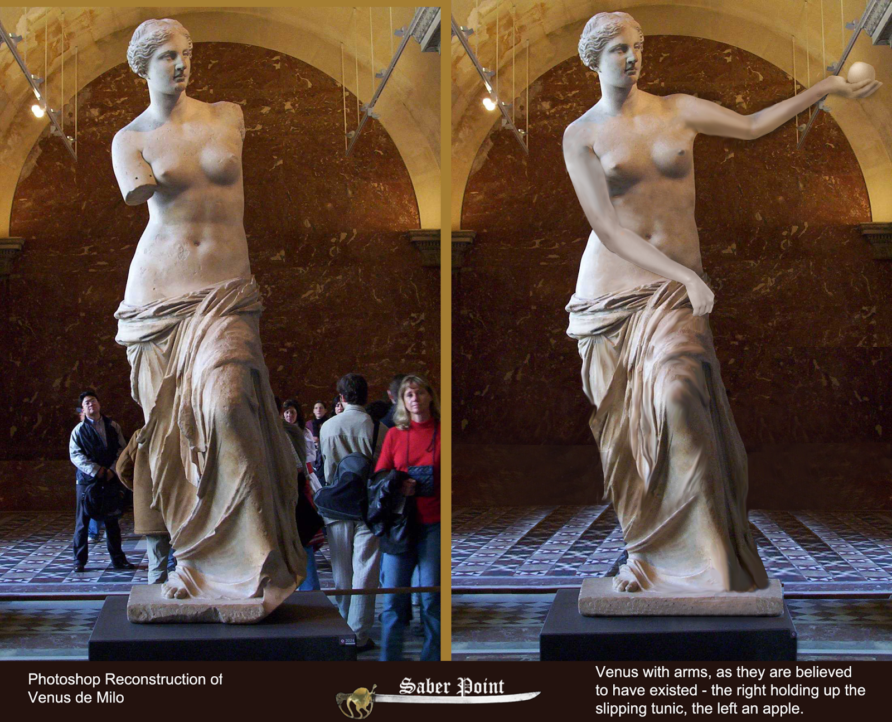

Identity
========

Another fundamental ontological notion you need to grasp before you
start modelling is the ontological notion of identity. To start the
discussion, let's take a look at the picture below:

.. container:: figure

   |Venus de Milo|

As you might know, that is Aphrodite of Milos, better known as the Venus
de Milo, an ancient Greek statue and one of the most famous works of
ancient Greek sculpture
(`Wikipedia <https://en.wikipedia.org/wiki/Venus_de_Milo>`__). On the
left side, it's the statue's current state, and on the right, it's how
it was supposably built. My question for you is: *do these pictures
portrait the same individuals or different ones?* Is it the same statue
that went through some changes or these changes destroyed the first
individual (the statue with arms) and created a new one (the statue
without arms)? If you think like most people, your answer would be:
"Yes, they are the same individual.". Now, what if the statue was broken
into very little pieces, like in the picture below:

.. container:: figure

   |Marble chips|

Would you say that these marble debris are still the statue? Somehow our
intuition says no, right? These debris cannot be Venus anymore. But why
do we say "Yes" to the first question and "No" to the second one?
Because of our common sense identity principle for statue. An **identity
principle** is a sort of function we use to distinguish two individuals.
Let's use the simplest example of all: the identity principle of sets.
Two sets, A and B, are the same if, and only if, they have the same
elements. Therefore, if A = {1,2} and B = {2,3} then A != B. So the
identity of a set is defined by its members. Changing a member of a set
changes the identity of the set. Now, let's think about a more
complicated example. Let's say, the identity principle we adopt for
people. Could we say that someone's identity depends on their name? Or
some sort of identification code, like the American 'social security',
the Brazilian 'CPF' or the Italian 'codice fiscale'? The answer is *NO*!
These can't be used as our identification function. And I'll tell you
why... Let's start with a Person's name. Did you ever meet two folks
with the very same name? I have. If you don't believe, just go on
Facebook and experiment search for common names of your country. I just
searched for "João Carlos da Silva", a fairly common Brazilian name, and
I found at least 5 guys with that exact name. If name was our identity
function, we would not be able to distinguish between them. Another
problem with using name as identity is that often, people change their
names. Our function needs to be not only able to distinguish two
individuals in the same moment in time, but also through time. How else
would we be able to meet someone today and recognize that same person
tomorrow? So, our function needs to always return the same individual
for a given input. Now, let's analyze the reason why the social security
number (SSN), the codice fiscale and the CPF are not very good identity
principles for people. The answer is quite simple, our function needs to
apply to everybody. If you are not American or never worked in the USA,
you probably don't have a SSN, right? Even young children born in the
USA might not have. The last important fact about identity principle is
that every individual must have *exactly one*. So, what is the identity
principle for a person? One's fingerprint, iris pattern, DNA? Well, it
is really hard to define it, even though we know it is there. What we
can "touch" are what's called the **identity conditions**. These are
"parts" of the identity function, necessary conditions for identity but
not sufficient by themselves. In order for me to consider A and B as the
same Person they need to have the same birth date. And the statue need
to be made of the same material. Why identity principles and conditions
are important for us? Because by thinking about them we are guided in
the construction of our types hierarchy. They impose constraints on how
we can combine the different OntoUML constructs to design our conceptual
models. Will talk about these constraints when we present the
stereotypes usage. For now, just keep in mind that: Some types have the
characteristic of providing identity principles for their instances.
They are stereotype as: «Kind», «Collective», «Quantity», «Relator»,
«Mode» and «Quantity». Here are some examples:

.. container:: figure

   |Identity providers|

Some other types don't provide identity principle for their instances,
but they all share a common one. They are stereotyped as: «Subkind»,
«Role» and «Phase». Here are some examples:

.. container:: figure

   |Inherited identity|

Some other types don't provide identity and their instances follow
different identity principles. They are stereotyped as: «RoleMixin»,
«Mixin» and «Category». Here are some examples:

.. container:: figure

   |Mixed identity|

.. |Identity providers| image:: _images/ontouml_identity-provider.png
.. |Inherited identity| image:: _images/ontouml_inherited-identity.png
.. |Mixed identity| image:: _images/ontouml_mixed-identity.png
