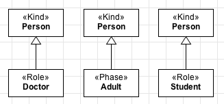

.. _individuals:

Types and Individuals
=====================

OntoUML is built upon the fundamental distinction between **Types** and **Individuals**. And that is because we like classifying things.

**Types** are abstract *things* we create to help us perceive and classify the world around us. These *things* work as bundles of characteristics we can expect to encounter in other particular *things* - the **individuals**.

Let's consider the type Person. Which characteristics does every Person have? We could say a head, a heart, arms, hands, legs, feet, eyes... Every person also has a weight, a height, an age. Maybe a name, place of birth, birthdate.

Now let's consider you and me. I am individual. And so are you. If you are reading this, I am confident to say that we are both people. We both have a heart, we both have a particular height and weight. We *exemplify* what it is to be a Person. The relation that holds between us and the type Person is called **instantiation**.

In OntoUML, we represent classes as boxes, just like in UML. Every class must have a name and a stereotype, as depicted in the figure below:

.. container:: figure

   |Examples of types|

Now, let's see some other examples of types and individuals them:

-  **Person**: Bill Gates, Linus Torvalds, Barack Obama, Steve Jobs,
   Alan Turing, Messi
-  **Football Player**: Neymar, Messi, Cristiano Ronaldo, Pelé, Maradona
-  **City**: Rio de Janeiro, Milano, Barcelona, New York City, London,
   Lisbon
-  **Operating System**: Windows, OS X, Ubuntu
-  **Company**: Apple, Samsung, Microsoft, Facebook, Nokia

If you pay close attention to the list, you will see that we've included Messi's name as an instance of Person and Football Player. And that is fine! In fact, it very common that an individual simultaneously instantiates many types. Me, for example, besides being a Person, I'm a Software Developer, a Brazilian, an Adult and a Man.

Whenever we refer to the term **extension of a type**, we mean every individual that instantiates that type in a particular instant of time. As an example, let's assume that the type Web Browser. Last year, we could say that its extension contained 5 individuals: Chrome, Internet Explorer, Safari, Firefox, Opera. This year, however, after Microsoft Edge's release, the extension of Browser grew by 1.

Whenever the extension of a type is always included in the extension of another type, we say that the former is a subtype of the latter. To represent this constraint in OntoUML models, we use the **generalization** (some people call it **specialization** instead) relation. We find countless examples of type specializations:

-  Doctor, Student and Child are subtypes of Person
-  Table, Mouse and Ball are subtypes of Object
-  Fridge, Stove and Microwave are subtypes of Appliance

We represent generalizations are lines with arrow heads on the end connected to the super-type, as shown in the figure below:

.. container:: figure

   |Generalization|

When we build a model in OntoUML we are formally defining types by specifying the characteristics they impose on their instances.

.. warning::

   OntoUML *ONLY* supports the specification of *TYPES*. Therefore, you *CANNOT* specify an *INDIVIDUAL* in an OntoUML model. Making an analogy to regular UML, you can create Class Diagrams, but there is no Object diagram.

.. |Examples of types| image:: _images/ontouml_types-examples.png

