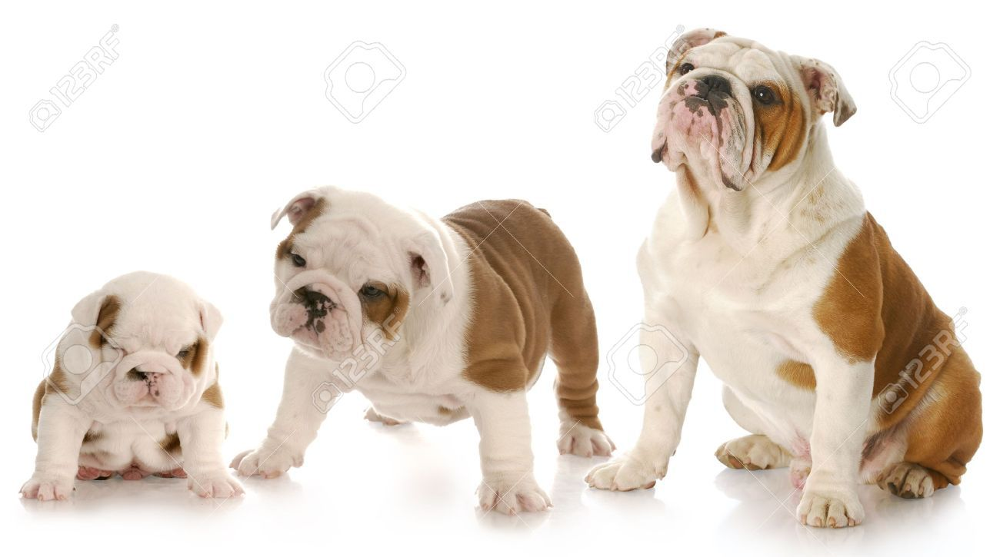

.. _rigidity:

Rigidity
========

Now that you are already familiar with the notion of type, individual
and instantiation, let's go through a fundamental ontological
meta-property of types - rigidity. To start, let's take a look at the
following pictures:

|Dog phases|

They show a dog's development through the
years (let's call him Rex for now). In the first frame (and maybe also
in the second) Rex is a Puppy. In the third one he is not a Puppy
anymore, but an Adult. However, in all three frames Rex is a Dog and a
French Bulldog. Let's focus on the types Dog and French Bulldog. Can you
imagine any other point in time, besides the three shown in the
pictures, in which Rex ceased to be either a Dog or a Bulldog? I guess
not. Let's expand our imagination a little. Can you imagine any
individual that used to be a Dog but is not anymore? I bet the answer is
also no. If an individual must instantiate a given type in all possible
scenarios in which the individual exists, we call that type **RIGID**.
In other words, rigid types are the ones who define essential
characteristics to their instances. Other examples of rigid types are:
Person, Car, Band, Apple, Country and Company. List of rigid
stereotypes: «:ref:`category`», «:ref:`collective`», «:ref:`kind`», «:ref:`mode`», «:ref:`quality`»,
«:ref:`quantity`», «:ref:`relator`», and «:ref:`subkind`».

.. container:: figure

   |Rigid examples|

Now, let's focus solely on the type Puppy. By looking at the pictures,
we can see that Rex used to be a puppy, but stopped being one after he
grew older. Just like Rex, every other dog was once a puppy or will
cease to be one someday. If every individual that instantiate a given
type in a particular time can cease to do so and still exists, then we
call that type **ANTI-RIGID**. Examples of anti-rigid types are:
Student, Employee, Spouse, Elder, Living Person and Healthy Person. List
of anti-rigid stereotypes: «:ref:`role`», «:ref:`phase`» and «:ref:`rolemixin`»

.. container:: figure

   |AntiRigid examples|

.. |Rigid examples| image:: _images/ontouml_rigid-examples.png
.. |AntiRigid examples| image:: _images/ontouml_antirigid-exampels.png

